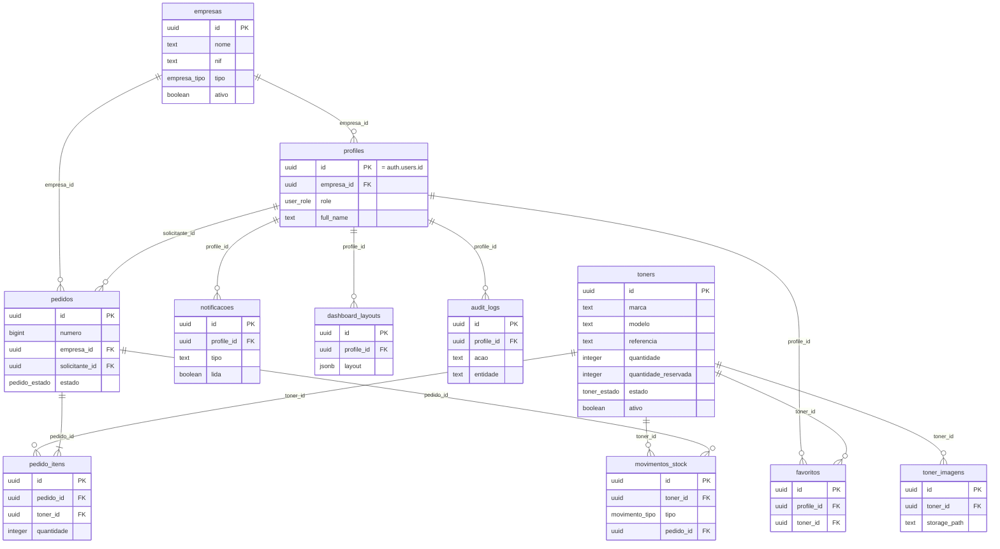

# Esquema da Base de Dados — Fase 2

Ver migração completa em [`migrations/0001_core_schema.sql`](migrations/0001_core_schema.sql).

## Diagrama relacional



## Fluxo de estados do pedido

```
recebido → em_analise → aprovado → em_preparacao → pronto_levantamento → concluido
                       ↘ recusado
(qualquer estado antes de concluido) → cancelado
```

## Reserva automática de stock

- Ao criar um `pedido_itens`, a trigger `reservar_stock_ao_criar_item` soma a quantidade a `toners.quantidade_reservada` (e recusa se exceder o disponível).
- Ao mudar `pedidos.estado` para `recusado`/`cancelado`, a trigger `aplicar_transicao_estado_pedido` liberta a reserva.
- Ao mudar para `concluido`, a mesma trigger dá baixa real ao stock (`quantidade`) e regista um `movimentos_stock` do tipo `saida`.

## O que falta (fases seguintes)

- **Fase 3**: políticas RLS completas por `role` (administrador/gestor/operador/leitor/cliente) em todas as tabelas — atualmente só o catálogo de toners ativos é público.
- **Fase 9**: ativar Realtime nas tabelas `pedidos` e `notificacoes`.
- Seeds de dados de exemplo (marcas, toners, empresas fictícias) para testes — a criar quando o CRUD do BackOffice existir.
